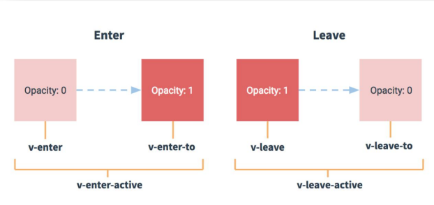
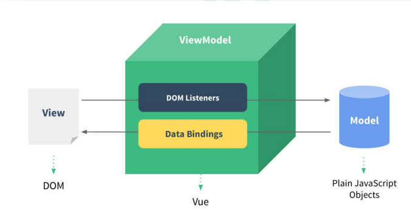

# Vue 汇总

1. 什么是Vue?

   一套用于构建用户界面的轻量级渐进式JavaScript框架。

2. Vue的特点：

   - 组件化模式
   - 声明式编码
   - 虚拟DOM+优秀的diff算法

---

## 一、基础

### 1. 数据绑定

- 单向数据绑定：`v-bind` 【数据只能从 data 流向页面】
- 双向数据绑定：`v-model` 

### 2. 事件处理

- v-on:xxx="fun"
- 默认事件形参: even
- 隐含属性对象: $event

- 事件修饰符：
  1. prevent 阻止默认事件
  2. stop 阻止事件冒泡
  3. once 事件只触发一次
  4. capture 使用事件的捕获模式
  5. self 只有event.target是当前操作的元素时才触发事件
  6. passive 事件的默认行为立即执行，无需等待事件回调执行完毕[移动端项目]

- 键盘事件：
  - @keyup
  - @keydown
  - event.keyCode

---

### 4. 计算属性

- 定义：要用的属性不存在，要通过已有属性计算得来

- 原理：借助`Object.defineproperty`方法提供的getter和setter.

  - **get函数什么时候执行？**

    > 当有人读取 fullName 时，get就会被调用，且返回值就作为 fullName 的值。

    - 初次读取 value 时
    - 所依赖的数据发生变化时

- 优势：与methods实现相比，内部有缓存机制，效率更高，调试方便。

- 备注：
  - 计算属性最终会出在vm上，直接读取使用即可。
  - 如果计算属性要被修改，那必须写set函数去响应修改，且set中要引起计算时依赖的数据发生改变。

~~~ js
computed: {
    fullName: {
        get(){
            console.log('get---');
            return this.firstName + '-' + this.lastName;
        },
            // fullName被修改时调用 
            set(value){
                const arr = value.split('-');
                this.firstName = arr[0];
                this.lastName = arr[1];
            }
    }
}
~~~

---

### 5. 监视属性

监视属性watch:

- 当被监视的属性变化时，回调函数(handler)自动调用，进行相关操作

- 监视的属性必须存在，才能进行监视

- 监视的两种写法：
  - new Vue时传入watch配置
  - 通过vm.$watch()监视

**深度监视：**

- vue中的watch默认不监测对象内部值的改变（一层）

- 配置deep:true,可以检测对象内布值改变（多层）

- 备注：
  - Vue自身可以检测对象内部值的改变，但vue提供的watch默认不可以。 
  - 使用watch时根据数据的具体结构，决定是否采用深度监视。

~~~ js
watch:{/* 可以监视 属性、计算属性 */
    isHot: {
        // 初始化时让handler调用一下。
        immediate: true,
            /* 
                    handler 什么时候调用？
                        - 当isHot发生改变时调用。
                    */
            handler(newValue, oldValue){
            console.log('isHot被修改了');
            console.log(newValue, oldValue);
        }
    }
}
~~~


---

### 6. 条件渲染

- 如果需要频繁切换 v-show 较好
- 当条件不成立时, v-if 的所有子节点不会解析(项目中使用)

### 7. 列表渲染——VUE监视数据的原理

- 没有为【数组】准备的 get & set。

- 数组修改：

  - vm._data.student.hobby[0] = 'study' 【不认！】
  - 必须调用数组身上可以修改数组的方法，才会承认修改。
  - Vue.set(vm._data.student.hobby, 1, "打台球")

  - Vue.$set(vm._data.student.hobby, 1, "打台球")

- 修改数组会调用的方法：
  1. push()
  2. pop()
  3. shift()、
  4. unshift()
  5. splice()
  6. sort()
  7. reverse()

- Vue如何检测到用了 以上方法 ？
  - 包裹 !important
  - vm._data.student.hobby.push === Array.prototype.push   [false]
  - 此处的push是 Vue 写的push
    - 先调Array.prototype.push
    - 重新解析模板，生成虚拟DOM...

---

### 8. 过滤器

- 功能: 对要显示的数据进行特定格式化后再显示。
- 注意: 并没有改变原本的数据, 是产生新的对应的数据

~~~ html
<!-- 过滤器实现 -->
<h5>过滤器实现：{{time | timeFormater}}</h5>

<!-- 过滤器【传参】实现 -->
<h5>过滤器实现2：{{time | timeFormater2('YYYY_MM_DD')}}</h5>

<!-- 多个过滤器 -->
<h5>过滤器实现2：{{time | timeFormater2('YYYY_MM_DD') | mySlice}}</h5>
~~~

~~~ js
// 全局过滤器
Vue.filter('name', function(value){
    return value.slice(0, 4);
})

filters: {/* 局部过滤器 */
    timeFormater(value){
        return dayjs(value).format('YYYY/MM/DD HH:mm:ss')
    },
        timeFormater2(value, str='YYYY|MM|DD HH:mm:ss'){
            return dayjs(value).format(str)
        },
            mySlice(value){
                return value.slice(0, 4)
            }
}    
~~~

----

### 9. 自定义指令

配置对象中常用的3个回调：

- bind
- inserted
- update

~~~ js
directives: {
            /*  
                big函数何时会被调用？
                    - 指令与元素成功绑定时(一上来)
                    - 指令所在的模板被重新解析时。
            */
            'big-number': function(element, binding){
                console.log('big-number', this); // window
                element.innerText = binding.value * 10;
            },
            'fbind':{
                // 指令与元素成功绑定时（一上来）
                bind(element, binding){
                    element.value = binding.value;
                },
                inserted(element, binding){
                    element.focus();
                    console.log(this); // window
                },
                update(element, binding){
                    element.value = binding.value;
                }
            } 
        }
~~~

---

### 10. 生命周期

#### 10.1 VUE2


---

#### 10.2 VUE3


---

### 11. 非单文件组件

- 关于this指向：
  - 组件配置中：data函数、methods中的函数、watch中的函数、computed中的函数 它们的this均是【VueComponent实例对象】。
  - new Vue(options)配置中：data函数、methods中的函数、watch中的函数、computed中的函数 它们的this均是【Vue实例对象】

~~~ js
VueComponent.prototype.__proto__ === Vue.prototype   [!important]
vm.__proto__ === Vue.prototype
~~~

- 非单文件组件： 一个文件中包含有n各组件。
- 单文件组件：  一个文件中包含有1个组件。[开发为单文件组件]

---


## 二 、VUE2

### 1. ref 属性

- 被用来给给元素或子组件注册引用信息（id的替代者）。

- 应用在html标签上获取的是真DOM元素。

- 应用在组件标签上是获取组件实例对象。

~~~ vue	
<template>
    <div>
        <h1 v-text='msg' ref='title' id='title'></h1>
        <button @click="showDOM">点我输出上方的DOM元素</button>
        <School ref="sch" />
    </div>
</template>

<script>
import School from './components/School'
export default {
    name: 'App',
    data() {
        return {
            msg: '欢迎学习VUE'
        }
    },
    components: {
        School
    },
    methods: {
        showDOM(){
            // document.getElementById('title')

            // this[vc实例对象]
            console.log(this.$refs.title);

            // school组件的实例对象
            console.log(this.$refs.sch);
        }
    }
}
</script>
~~~

### 2. props 属性

- 作用：用于父组件给子组件传递数据

- props: ['name', 'age', 'setName']

- ~~~ js
  props: {
      name: String, 
      age: Number, 
      setNmae: Function
  }
  ~~~

- 读取方式三: 指定名称/类型/必要性/默认值

  ~~~ js
  props: {
  	name: {
          type: String, 
          required: true, 
          default:xxx}, 
  }
  ~~~

### 3. 混入mixin

- 把多个组件共用的配置提取成一个混入对象

~~~ js
mixins: [mixin]
~~~

### 4. 插件 plugins

通过 install 方法给 Vue 或 Vue 实例添加方法, 定义全局指令。

~~~ js
const obj = {
    install(Vue){
        console.log('@@@instal', Vue);

        // 全局过滤器
        Vue.filter('mySlice', function(value){
            return value.slice(0, 4)
        })

        // 定义全局指令
        Vue.directive('fbind',{
            //指令与元素成功绑定时（一上来）
            bind(element,binding){
                element.value = binding.value
            },
            //指令所在元素被插入页面时
            inserted(element){
                element.focus()
            },
            //指令所在的模板被重新解析时
            update(element,binding){
                element.value = binding.value
            }
        })

        // 定义混入
        Vue.mixin({
            data() {
                return {
                    x:100,
                    y:200
                }
            },
        })

        //给Vue原型上添加一个方法（vm和vc就都能用了）
        Vue.prototype.demo = () => {
            console.log('hello Vue');
        }
    }
}

export default obj;
~~~

~~~ js
// 使用
import plugins from './plugins'
Vue.use(plugins)
~~~

---

### 5. scoped

让样式在布局生效。

~~~shell
npm i less-loader

npm view webpack versions

npm view less-loader versions

npm i less-loader@7
~~~

### 6. 浏览器本地存储

~~~ js
sessionStorage.setItem('msg', 'hello!!')
sessionStorage.getItem('msg')
sessionStorage.removeItem('msg')
sessionStorage.clear();

localStorage.setItem('per', JSON.stringify(p));
JSON.parse(localStorage.getItem('per'))
localStorage.removeItem('msg')
localStorage.clear();
~~~

---

### 7. 父子传参

1. props 父串子 , 子通过函数给 父传递参数

   ~~~ js
   // 父 App.vue
   <MyHeader :addTodo='addTodo'></MyHeader>
   
   addTodo(todoObj){
       this.todos.unshift(todoObj)
   },
   ~~~

   ~~~ js
   // 子
   props:['addTodo'],
   methods:{
           add(event){
               const todoObj = {
                   id: nanoid(),
                   title: event.target.value,
                   done: false
               }
               this.addTodo(todoObj);
           }
   }
   ~~~

---

2. **自定义事件** 子传父

   ~~~ js
   // App
   <Student v-on:atguigu='demo' @test='getSchoolName'/>
    
   methods: {
           getSchoolName(name){
               console.log('yess!!!!', name);
               this.schoolName = name;
           },
           demo(name){
               console.log('demo被调用了', name);
               this.studentName = name;
           },
    },
   ~~~

   ~~~ js
   // 子组件
   <button @click='sendStudentName'>传递学生name</button>
   <button @click='unbind'>解绑atguigu事件</button>
   <button @click="death">销毁student组件</button>
   
    methods: {
           sendStudentName(){
               this.$emit('atguigu', this.name)
           },
           unbind(){
               // 解绑一个自定义事件
               // this.$off('atguigu');
   
               // 解绑多个自定义事件
               this.$off(['atguigu', 'test']);
   
               // 解绑所有自定义事件
               // this.$off();
           },
           death(){
               // 销毁vc组件实例后，绑定在自身上的自定义事件都是不奏效的。
               this.$destroy()
           }
       }
   ~~~

---

3. 全局事件总线GlobalEventBus  实现任意组件间通信。

   ~~~ js
   VueComponent.prototype.__proto__ === Vue.prototype
   ~~~

   - 安装全局事件总线

   ~~~ js
   new Vue({
       el: '#app',
       render: h => h(App),
       beforeCreate(){
           // 安装全局事件总线
           Vue.prototype.$bus = this;
       }
   })
   ~~~

   ~~~ js
   $on(eventName, listener): 绑定自定义事件监听
   $emit(eventName, data): 分发自定义事件
   $off(eventName): 解绑自定义事件监听
   $once(eventName, listener): 绑定事件监听, 但只能处理一次
   ~~~

   ~~~ js
   beforeDestroy(){
       this.$bus.$off('checkTodo');
       this.$bus.$off('deleteTodo');
   }
   ~~~

---

4. 消息订阅与发布

   - 订阅消息 --对应绑定事件监听 
   - 发布消息 --分发事件 
   - 取消消息订阅 --解绑事件监

   ~~~ js
   // 订阅
   this.id = pubsub.subscribe('hello', (msgName, data)=>{
       console.log('有人发布了hello', msgName, data);
   })
   
   // 发布
   pubsub.publish('hello', this.studentName);
   
   // 取消订阅
   pubsub.unsubscribe(this.id);
   ~~~

---

### 8. nextTick

1. 语法：this.$nextTick(回调函数)
2. 在下次 DOM 更新循环结束之后执行延迟回调。在修改数据之后立即使用这个方法，获取更新后的 DOM。

2. 作用：在下一次DOM更新结束后执行其指定的回调。

3. 当数据改变后，要基于更新后的新DOM进行某些操作时，要在nextTick所指定的回调函数中执行。
4. [掘金](https://juejin.cn/post/6844903843197616136)

---

### 9. 动画效果



---

### 10. 代理

#### 10.1 发送 ajax 请求： 

- new XMLHttpRequest()
- jQuery
- axios
- fetch[window内置有，promise风格]
- vue-resource

#### 10.2 解决跨域

- CORS（跨域资源共享）

  Access-Control-Allow-Origin

- jsonp (只能解决get请求)

- 配置代理服务器

  - ngix
  - vue-cli (devServer.proxy)

---

### 11. 插槽 slot 

让父组件向子组件指定位置插入html结构，也是一种组件间通信方式。

- 默认插槽
- 具名插槽
- 作用域插槽

---

- 数据在组件(定义插槽)的自身,但根据数据生成的结构需要组件的使用者来决定。
- 插槽内容是在父组件中编译后, 再传递给子组件的

---

## 三、VUEX

- 专门在Vue中实现 **集中式状态（数据）管理**的一个Vue插件。

- 对vue应用中多个组件的共享状态进行集中式的管理（读/写）。

- 也是一种组件间通信的方式。

- 多组件共享数据：

  - 全局事件总线实现

  - Vuex

- 什么时候使用Vuex:

  - 多个组件依赖同一状态。

  - 来自不同组件的行为需要变更同一状态。

---

实现：

~~~ js
// store/index.js
// 该文件用于传创建vuex中最为核心的store

import Vue from 'vue'
import Vuex from 'vuex'

Vue.use(Vuex);

// 准备actions---用于响应组件中的动作
const actions = {};
// 准备mutations---用于操作数据
const mutations = {};
// 准备state---用于存储数据
const state = {};
// 准备getters---用于将state中的数据进行加工
const getters = {}

const store = new Vuex.Store({
    actions: actions,
    mutations: mutations,
    state: state,
    getters
});

// 暴露store
export default store;
~~~

~~~ js
// main.js

// 引入store
import store from './store/index'
// 创建 vm
const vm = new Vue({
    el: '#app',
    render: h => h(App),
    store: store,
    // 安装全局事件总线
    beforeCreate(){
        Vue.prototype.$bus = this;
    }
})
~~~

### 1. mapState & mapGetters

~~~ js
computed:{
    /* sum(){
            return this.$store.state.sum;
        }, */
    /* school(){
            return this.$store.state.school;
        }, */

    // 借助mapState生成计算属性，从state中读取数据。[对象写法]
    ...mapState({sum: 'sum', 
                 school: 'school', 
                 subject:'subject'}),

        // 借助mapState生成计算属性，从state中读取数据。[数组写法]
        // ...mapState(['sum', 'school', 'subject']),

        /* bigSum(){
            return this.$store.state.bigSum;
        } */
        ...mapGetters({bigSum: 'bigSum'})
    // ...mapGetters(['bigSum'])
},
~~~

### 2. mapActions & mapMutations

~~~ js
// 借助mapMutations生成对应的方法，方法中会调用commit去联系mutations !!!!!
...mapMutations({
    JIA: 'JIA',
    decrement: 'JIAN'
}),

// mapActions !!!!
...mapActions({
    incrementOdd: 'jiaOdd'
})
~~~


## 四、Vue-router

- 路由route & 路由器router

- 路由就是一组key-value的对应关系。
  - key：路径
  - value: component(前端路由) \ function(后端路由)

- 多个路由，需要经过路由器（router）管理。

---

### 1. 路由参数

- query 参数

  ~~~ vue
  <router-link :to="`/home/message/detail?id=${message.id}&title=${message.title}`">{{message.title}}</router-link>
  ~~~

  ~~~ vue
  <router-link :to="{
                    path: '/home/message/detail',
                    query: {
                        id: message.id,
                        title: message.title
                    }
           }">
      {{message.title}}
  </router-link>
  ~~~

  

- params 参数

  ~~~ vue
  <router-link :to="`/home/message/detail/${message.id}/${message.title}`">{{message.title}}</router-link>
  ~~~

  ~~~ vue
  <router-link :to="{
                    name: 'xiangqing',
                    params: {
                        id: message.id,
                        title: message.title
                    }
           }">
      {{message.title}}
  </router-link>
  <!-- 路由携带params参数时，若使用to的对象写法，则不能使用path配置项，必须使用name配置！！！ -->
  ~~~

  ~~~ js
  // router.js
  /* params参数需要占位！！！ */
  path: 'detail/:id/:title',
  ~~~

---


### 2. 编程式路由导航 & 声明式路由导航

- params ——props

~~~ js
path: 'message',
    component: Message,
        children: [
            {
                /* :占位符 */
                /* params参数需要占位！！！ */
                name: 'xiangqing',
                path: 'detail/:id/:title',
                component: Detail,

                // props的第一种写法，值为对象
                // 该对象中的所有key-value都会以props的形式传给Detail组件。
                /* props: {
                                a: 1, 
                                b: 'hello'
                            } */

                // props第二种写法，值为布尔值
                // 若布尔值为真，就会把该路由组件收到的所有params参数，以props的形式传给Detail组件。
                props: true
            }]
~~~

- query —— props

~~~ js
name: 'xiangqing',
    path: 'detail',
        component: Detail,

            // props的第一种写法，值为对象
            // 该对象中的所有key-value都会以props的形式传给Detail组件。
            /* props: {
                                a: 1, 
                                b: 'hello'
                            } */

            // props第二种写法，值为布尔值
            // 若布尔值为真，就会把该路由组件收到的所有params参数，以props的形式传给Detail组件。
            // props: true


            // props第三种写法，值为函数
            props($route){
            // this---->undefined

            // console.log($route);
            return {
                id: $route.query.id,
                title: $route.query.title
            }
        }
}
~~~


### 4. router-link的 replace属性

1. 浏览器默认为push

2. 可以修改为repalce 记录

~~~ js
<router-link replace class="list-group-item" active-class="active" to="/about">About</router-link> 
~~~

### 5. 缓存路由组件

~~~ vue	
<ul class="nav nav-tabs">
    <li>
        <router-link class="list-group-item" active-class="active" to="/home/news">News</router-link>
    </li>
    <li>
        <router-link class="list-group-item" active-class="active" to="/home/message">Message</router-link>
    </li>
</ul>

<!-- 避免走销毁路程！！！！ -->
<!-- 加入include, 只保持News！！，其余message正常销毁 -->
<keep-alive include="News">
    <router-view></router-view>
</keep-alive>

<keep-alive :include="['News', 'Message']">
    <router-view></router-view>
</keep-alive>
~~~


### 6. 路由钩子

- actived
- deactived

~~~ js
// 路由组件独有！！！   
activated(){
    console.log('News组件被激活');
    this.timer = setInterval(()=>{
        this.opacity -= 0.01;
        if(this.opacity <= 0){
            this.opacity = 1;
        }
    }, 18)
},
deactivated(){
     console.log('News组件失活');
     clearInterval(this.timer);
}
~~~

### 7. 路由守卫

#### 7.1 全局路由守卫

~~~ js
// 全局前置路由守卫————初始化的时候被调用、每次路由切换之前被调用
router.beforeEach((to, from, next)=>{
    console.log(to, from);
    console.log('前置路由守卫');

    // 设置title
    // document.title = to.meta.title || '硅谷系统'

    if(to.meta.isAuth){
        if(localStorage.getItem('school') === 'atguigu'){
            next();
        }
    }else{
        next()
    }
})

~~~

~~~ js
// 全局后置路由守卫————初始化的时候被调用、每次路由切换之后被调用
// 后置路由守卫
router.afterEach((to, from)=>{
    console.log('后置路由守卫');
    console.log(to, from);
    document.title = to.meta.title || '硅谷系统'
})
~~~

#### 7.2 路由独享守卫

~~~ js
routes: [
    {
        path: '/foo',
        component: Foo,
        beforeEnter: (to, from, next) => {
            // ...
        }
    }
]
~~~


#### 7.3 组件内路由守卫

~~~ js
beforeRouteEnter(to, from, next) {
    // 在渲染该组件的对应路由被 confirm 前调用
    // 不！能！获取组件实例 `this`
    // 因为当守卫执行前，组件实例还没被创建
  },
  beforeRouteUpdate(to, from, next) {
    // 在当前路由改变，但是该组件被复用时调用
    // 举例来说，对于一个带有动态参数的路径 /foo/:id，在 /foo/1 和 /foo/2 之间跳转的时候，
    // 由于会渲染同样的 Foo 组件，因此组件实例会被复用。而这个钩子就会在这个情况下被调用。
    // 可以访问组件实例 `this`
  },
  beforeRouteLeave(to, from, next) {
    // 导航离开该组件的对应路由时调用
    // 可以访问组件实例 `this`
  }
~~~

---

### 8. 滚动行为

使用前端路由，当切换到新路由时，想要页面滚到顶部，或者是保持原先的滚动位置，就像重新加载页面那样。 `vue-router` 能做到，而且更好，它让你可以自定义路由切换时页面如何滚动。

~~~ js
const router = new VueRouter({
  routes: [...],
  scrollBehavior (to, from, savedPosition) {
    // return 期望滚动到哪个的位置
     return { x: 0, y: 0 }
  }
})
~~~

### 9. 路由懒加载

~~~ js
const Foo = () => import('./Foo.vue')
~~~

~~~ js
const router = new VueRouter({
  routes: [{ path: '/foo', component: Foo }]
})
~~~

---

### 10. history & hash

- /#/xx/xxx/，#后边的不会被发送 【hash值】

- history模式，不带 #

---

## 五、VUE3

### 1.性能的提升

- 打包大小减少41%

- 初次渲染快55%, 更新渲染快133%

- 内存减少54%

  ......

### 2.源码的升级

- 使用Proxy代替defineProperty实现响应式

- 重写虚拟DOM的实现和Tree-Shaking

  ......

### 3.拥抱TypeScript

- Vue3可以更好的支持TypeScript

### 4.新的特性

1. Composition API（组合API）

   - setup配置
   - ref与reactive
   - watch与watchEffect
   - provide与inject
   - ......
2. 新的内置组件
   - Fragment 
   - Teleport
   - Suspense
3. 其他改变

   - 新的生命周期钩子
   - data 选项应始终被声明为一个函数
   - 移除keyCode支持作为 v-on 的修饰符
   - ......

---

###  5. ref函数

- 作用: 定义一个响应式的数据
- 语法: ```const xxx = ref(initValue)``` 
  - 创建一个包含响应式数据的<strong style="color:#DD5145">引用对象（reference对象，简称ref对象）</strong>。
  - JS中操作数据： ```xxx.value```
  - 模板中读取数据: 不需要.value，直接：```<div>{{xxx}}</div>```
- 备注：
  - 接收的数据可以是：基本类型、也可以是对象类型。
  - 基本类型的数据：响应式依然是靠``Object.defineProperty()``的```get```与```set```完成的。
  - 对象类型的数据：内部 <i style="color:gray;font-weight:bold">“ 求助 ”</i> 了Vue3.0中的一个新函数—— ```reactive```函数。

---

### 6. reactive函数

- 作用: 定义一个<strong style="color:#DD5145">对象类型</strong>的响应式数据（基本类型不要用它，要用```ref```函数）
- 语法：```const 代理对象= reactive(源对象)```接收一个对象（或数组），返回一个<strong style="color:#DD5145">代理对象（Proxy的实例对象，简称proxy对象）</strong>
- reactive定义的响应式数据是“深层次的”。
- 内部基于 ES6 的 Proxy 实现，通过代理对象操作源对象内部数据进行操作。

~~~ js
setup() {
    // 数据
    let name = ref('张三');
    let age = ref(18);

    /* object:objectDefineProperty--->reactive:proxy(es6新提出的) */
    let job = reactive({
        type: 'web 工程师',
        salary: '20k',
        a:{
            b:{
                c:333
            }
        }
    })
    let hobby = reactive(['smoke', 'game', 'sing'])

    // 方法
    function changeInfo(){
        console.log(job);

        // ref 处理 基本数据类型
        name.value = 'Denny';
        age.value = 12;

        // reactive处理对象类型
        job.type = 'UI设计师';
        job.salary = '18k';
        job.a.b.c = 111;

        // reactive处理数组
        console.log(hobby);
        hobby[0] = '学习'
    }

    // 返回一个对象[常用！！]
    return {
        name,
        age,
        job,
        hobby,
        changeInfo
    }

~~~

…..

## 六、面试题整理

#### 1. MVC & MVVM

- MVC即模型、视图、控制器（Model View Controller）

  - View 接受用户交互请求
  - View 将请求转交给**Controller**处理
  - Controller 操作Model进行数据更新保存
  - 数据更新保存之后，Model会通知View更新
  - View 更新变化数据使用户得到反馈

- MVVM即模型（data中的数据）、视图（模板）、视图模型（Model-View-ViewModel）（Vue实例对象）

  

  - View 接收用户交互请求
  - View 将请求转交给**ViewModel**
  - ViewModel 操作Model数据更新
  - Model 更新完数据，通知ViewModel数据发生变化
  - ViewModel 更新View数据

---

- 不同点：
  1. ViewModel 替换了 Controller，在UI层之下
  2. ViewModel 向 View 暴露它所需要的数据和指令对象
  3. ViewModel 接收来自 Model 的数据

---

#### 2. v-if v-show v-html

- v-if 会调用 `addIfCondition` 方法，生成 vnode 的时候会忽略对应节点，render 的时候就不会渲染。
- v-show 会生成 vnode ，render 的时候也会渲染成真实的节点，只是在render 过程中会在节点的属性中修改 show 属性值，即 display。
- v-html 会先移除节点下所有节点，调用html方法，通过 addProp 添加 innerHTML 属性。


## 七、插件库

- dayjs 格式化时间。
- 


## 八、vite

官方文档：https://v3.cn.vuejs.org/guide/installation.html#vite

vite官网：https://vitejs.cn

- 什么是vite？—— 新一代前端构建工具。
- 优势如下：
  - 开发环境中，无需打包操作，可快速的冷启动。
  - 轻量快速的热重载（HMR）。
  - **真正的按需编译，不再等待整个应用编译完成。**
- 传统构建 与 vite构建对比图


```bash
## 创建工程
npm init vite-app <project-name>
## 进入工程目录
cd <project-name>
## 安装依赖
npm install
## 运行
npm run dev
```
